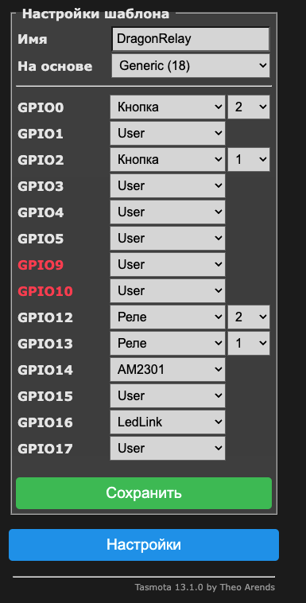
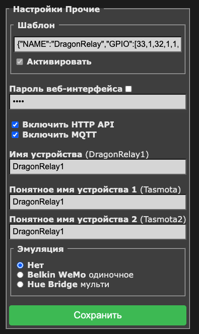
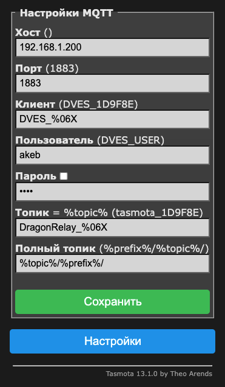

# Dragon Relay


## USB to Serial Connect

```text
Красный провод: 5 В
Черный провод: GND
Белый провод: RXD
Зеленый провод: TXD
Желтый провод: RTS
Синий провод: CTS
```

При прошивке, когда в консоле будет написано Connecting... нужно нажать btn2 примерно на секунду и отпустить. Если не нанет прошивать, повторить нажатие.

## PINS GPIO

```text
13 - 1 Relay
12 - 2 Relay

2 - Button 1
0 - Button 2

14 - DHT
16 - Red led (USB Status)
```

## Tasmota

Go to the web Installer and follow the instructions [https://tasmota.github.io/install/](https://tasmota.github.io/install/)

При прошивке, когда в консоле будет написано Connecting... нужно нажать btn2 примерно на секунду и отпустить. Если не нанет прошивать, повторить нажатие.

After connecting to your Wi-Fi network, make the following settings

1. Перейдите к настройкам шаблона и создайте шаблон DragonRelay на основе Generic

- GPIO0 - Кнопка 2
- GPIO2 - Кнопка 1
- GPIO12 - Реле 2
- GPIO13 - Реле 1
- GPIO14 - AM2301 (Или ваш датчик DHT)
- GPIO16 - LedLink



2. В разделе прочии настройки указываем имя устройства и выключателей



3. В настройках MQTT указываем свои настройки



## ESPEasy

### Install 1M

First install Python and esptool.py

```bash
pip install esptool
```

```bash
esptool.py \
--chip esp8266 \
--baud 115200 \
--port /dev/cu.usbserial-A601NK9P \
write_flash -fs 1MB 0x00000 \
./blank_1MB.bin

esptool.py \
--chip esp8266 \
--baud 115200 \
--port /dev/cu.usbserial-A601NK9P \
write_flash -fs 1MB 0x00000 \
./ESP_Easy_mega_20230822_normal_ESP8266_1M.bin
```

### Install 4M1M

```bash
esptool.py \
--chip esp8266 \
--baud 115200 \
--port /dev/cu.usbserial-A601NK9P \
write_flash -fs 4MB 0x00000 \
./blank_4MB.bin

esptool.py \
--chip esp8266 \
--baud 115200 \
--port /dev/cu.usbserial-A601NK9P \
write_flash -fs 4MB 0x00000 \
./ESP_Easy_mega_20230822_normal_ESP8266_4M1M.bin
```

### First Connect

```text
http://192.168.4.1/
wifi password: configesp
```

### Use

[http://192.168.1.20/control?cmd=GPIO,12,1](http://192.168.1.20/control?cmd=GPIO,12,1)

[http://192.168.1.20/control?cmd=GPIO,13,1](http://192.168.1.20/control?cmd=GPIO,13,1)

[http://192.168.1.20/control?cmd=GPIO,12,0](http://192.168.1.20/control?cmd=GPIO,12,0)

[http://192.168.1.20/control?cmd=GPIO,13,0](http://192.168.1.20/control?cmd=GPIO,13,0)

[http://192.168.1.20/control?cmd=Status,GPIO,12](http://192.168.1.20/control?cmd=Status,GPIO,12)

[http://192.168.1.20/control?cmd=Status,GPIO,13](http://192.168.1.20/control?cmd=Status,GPIO,13)

### Documentation

[https://www.letscontrolit.com/wiki/index.php/ESPEasy_Command_Reference](https://www.letscontrolit.com/wiki/index.php/ESPEasy_Command_Reference)

### Settings

#### Tools -> Advanced Settings

- Rules: True
- Enable Rules Cache: True
- Use NTP: True
- NTP Hostname: ntp0.ntp-servers.net
- Timezone Offset: 180
- JSON bool output without quotes: True

#### Rules

```text
//Изменение состояния реле 1 переключателем 1
on Button1#State do
  If [Button1#State]=1
    if [Relay1#State]=0
      gpio,13,1
    Else
      gpio,13,0
    Endif
  Endif
endon

//Изменение состояния реле 2 переключателем 2
on Button2#State do
  If [Button2#State]=1
    if [Relay2#State]=0
      gpio,12,1
    Else
      gpio,12,0
    Endif
  Endif
endon
```

#### Controllers

- Protocol: Home Assistant (openHAB) MQTT
- Locate Controller: {MQTT_HOST}
- Controller Port: {MQTT_PORT}
- Use Extended Credentials: True
- Controller User: {MQTT_USER}
- Controller Password: {MQTT_PASSWORD}
- Publish Retain Flag: True
- Enabled: True

#### Devices

- DHT11/12/22 SONOFF2301/7021/MS01
  - Name: DHT
  - Enabled: True
  - GPIO: GPIO-14 (D5)
  - Sensor model: DHT 22 (Or is yours some kind of)
  - Single event with all values: True
  - Send to Controller: True
  - Interval: 10
  - Values
    - Temperature
      - Name: Temperature
      - Decimals: 2
    - Humidity
      - Name: Humidity
      - Decimals: 2
  - Formula (if need) example: %value%-1.9 or %value%+14.2 (For correction)
- Switch input - Switch
  - Enabled: True
  - Name: Relay1
  - GPIO: GPIO-13 (D7)
  - Switch Type: Switch
  - Switch Button Type: Normal Switch
  - Send Boot state: True
  - Single event with all values: True
  - Send to Controller: True
  - Values
    - State
- Switch input - Switch
  - Enabled: True
  - Name: Relay2
  - GPIO: GPIO-12 (D6)
  - Switch Type: Switch
  - Switch Button Type: Normal Switch
  - Send Boot state: True
  - Single event with all values: True
  - Send to Controller: True
  - Values
    - State
- Switch input - Switch
  - Enabled: True
  - Name: Button1
  - Internal PullUp: True
  - Inversed Logic: True
  - GPIO: GPIO-2 (D4)
  - Switch Type: Switch
  - Switch Button Type: Normal Switch
  - Send Boot state: True
  - Values
    - State
- Switch input - Switch
  - Enabled: True
  - Name: Button2
  - Internal PullUp: False
  - Inversed Logic: True
  - GPIO: GPIO-0 (D3)
  - Switch Type: Switch
  - Switch Button Type: Normal Switch
  - Send Boot state: True
  - Values
    - State
