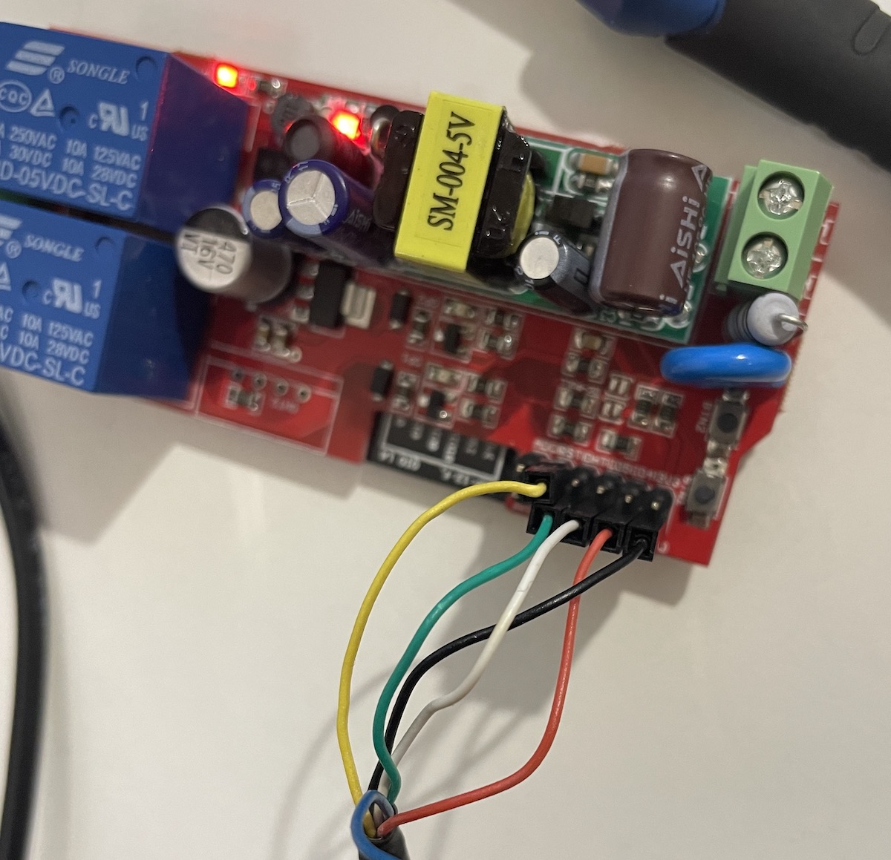
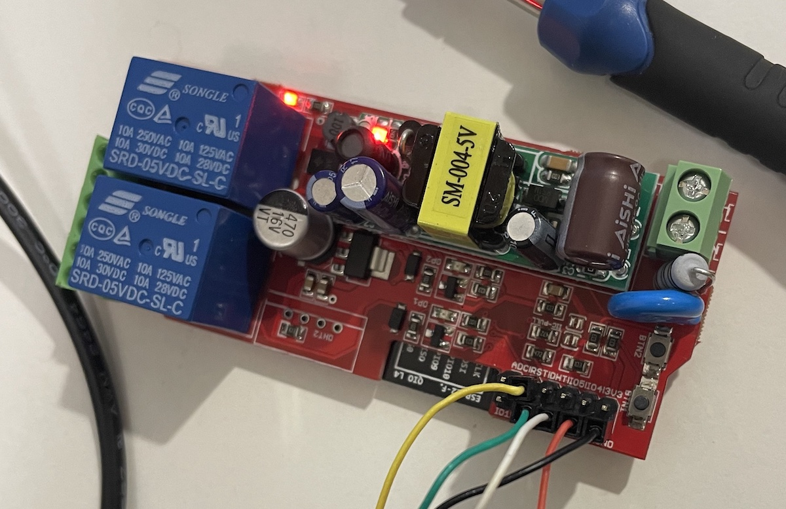

# Dragon Relay




## USB to Serial Connect

```text
Красный провод: 5 В
Черный провод: GND
Белый провод: RXD
Зеленый провод: TXD
Желтый провод: RTS
Синий провод: CTS
```

## PINS GPIO

```text
13 - 1 Relay
12 - 2 Relay

2 - Button 1
0 - Button 2

14 - DHT
16 - Red led (USB Status)
```

## ESPEasy

### Install 1M

```bash
/Library/Frameworks/Python.framework/Versions/3.11/bin/esptool.py \
--chip esp8266 \
--baud 115200 \
--port /dev/cu.usbserial-A601NK9P \
write_flash -fs 1MB 0x00000 \
./blank_1MB.bin

/Library/Frameworks/Python.framework/Versions/3.11/bin/esptool.py \
--chip esp8266 \
--baud 115200 \
--port /dev/cu.usbserial-A601NK9P \
write_flash -fs 1MB 0x00000 \
./ESP_Easy_mega_20230822_normal_ESP8266_1M.bin
```

### Install 4M1M

```bash
/Library/Frameworks/Python.framework/Versions/3.11/bin/esptool.py \
--chip esp8266 \
--baud 115200 \
--port /dev/cu.usbserial-A601NK9P \
write_flash -fs 4MB 0x00000 \
./blank_4MB.bin

/Library/Frameworks/Python.framework/Versions/3.11/bin/esptool.py \
--chip esp8266 \
--baud 115200 \
--port /dev/cu.usbserial-A601NK9P \
write_flash -fs 4MB 0x00000 \
./ESP_Easy_mega_20230822_normal_ESP8266_4M1M.bin
```

### First Connect

```text
http://192.168.4.1/
wifi password: configesp
```

### Use

[http://192.168.1.20/control?cmd=GPIO,12,1](http://192.168.1.20/control?cmd=GPIO,12,1)

[http://192.168.1.20/control?cmd=GPIO,13,1](http://192.168.1.20/control?cmd=GPIO,13,1)

[http://192.168.1.20/control?cmd=GPIO,12,0](http://192.168.1.20/control?cmd=GPIO,12,0)

[http://192.168.1.20/control?cmd=GPIO,13,0](http://192.168.1.20/control?cmd=GPIO,13,0)

[http://192.168.1.20/control?cmd=Status,GPIO,12](http://192.168.1.20/control?cmd=Status,GPIO,12)

[http://192.168.1.20/control?cmd=Status,GPIO,13](http://192.168.1.20/control?cmd=Status,GPIO,13)

### Documentation

[https://www.letscontrolit.com/wiki/index.php/ESPEasy_Command_Reference](https://www.letscontrolit.com/wiki/index.php/ESPEasy_Command_Reference)
